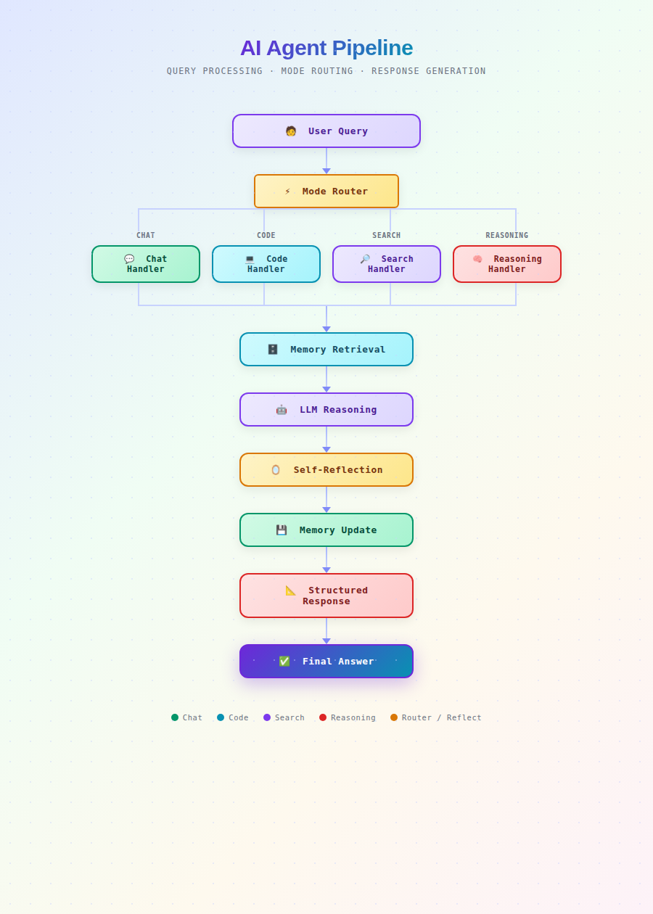

# 

> A production-ready AI system for structured technical research and analysis.


---

> **Project Goal:** Simulate how senior engineers research unfamiliar technical topics using memory, iteration, and structured reasoning.

---

## 

This project implements an intelligent research agent that answers technical questions using a multi-step workflow.

The system focuses on:

1. Classifies the query into quick or deep research mode
2. Retrieves relevant past context from persistent memory
3. Generates a structured technical analysis
4. Performs a self-review step to improve clarity and depth
5. Stores research context for future interactions

The goal is to simulate how a senior engineer researches unfamiliar technical topics — iteratively and with historical awareness.

---

## 

- **Dual research modes**
  - Quick mode for focused explanations
  - Deep mode for comparative analysis and tradeoffs

- **Persistent semantic memory**
  - User preferences and prior research stored in Qdrant
  - Context reused across sessions

- **Structured technical outputs**
  - Reports emphasize tradeoffs, design decisions, and practical usage

- **Self-reflection step**
  - The agent reviews and refines its own response before returning results

- **Model fallback**
  - Automatically switches models when API quota limits are reached

- **Local embeddings**
  - CPU-friendly embeddings using SentenceTransformers

---

## 

 

##

[](docs/demo.mp4)

### System Components

| Component | Purpose |
|-----------|----------|
| FastAPI | API Interface |
| LangGraph | Workflow Orchestration |
| Qdrant | Persistent Vector Memory |
| Gemini API | Primary Reasoning Model |
| Groq | Fallback Model |
| SentenceTransformers | Local Embedding Generation |

---


## 

### Quick Mode
Designed for short technical explanations.

**Target Latency:** < 30 seconds

### Deep Mode
Performs broader reasoning with comparisons and production considerations.

**Target Latency:** < 3 minutes

---

## 

The system stores and retrieves:

- User interaction preferences
- Previously explored topics
- Summarized research outputs

Memory retrieval is semantic rather than keyword-based.

This enables natural follow-up queries such as:

> "Go deeper on the earlier report"

---
## 

### 1. Install dependencies

```bash
pip install -r requirements.txt
````

### 2. Start Qdrant

```bash
docker compose up -d
```

### 3. Configure environment variables

Create a `.env` file:

```
GROQ_API_KEY=your_key
```

### 4. Initialize vector memory (one time)

```bash
python init_memory.py
```

### 5. Start the API

```bash
uvicorn main:app --reload
```

Open:

```
http://127.0.0.1:8000/docs
```

---

## 

```
Compare LoRA vs fine tuning tradeoffs for production systems
```

The agent returns a structured engineering report including tradeoffs and recommendations.

---

## 

This project prioritizes:

* reliability over raw model performance
* reproducible setup
* persistent learning behavior
* clear system structure

The intention is to show how AI agents can be organized as long-term engineering systems rather than simple prompt pipelines.

---

## 

* Embeddings run locally on CPU; no GPU required.
* Memory persists between restarts via Qdrant storage.
* API keys should be kept private and never committed to the repository.

---

## 

MIT License
